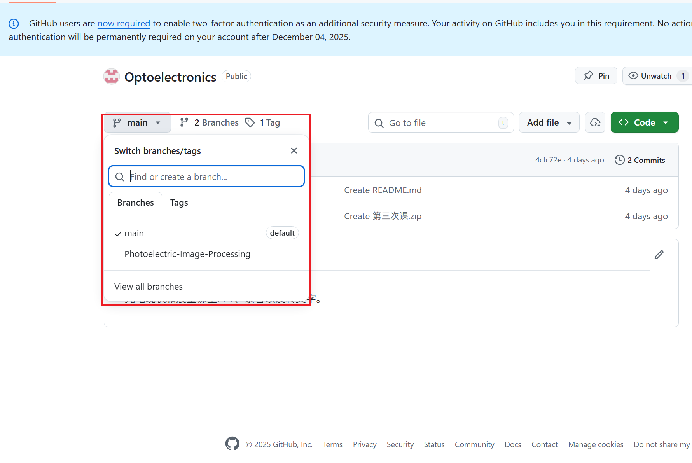
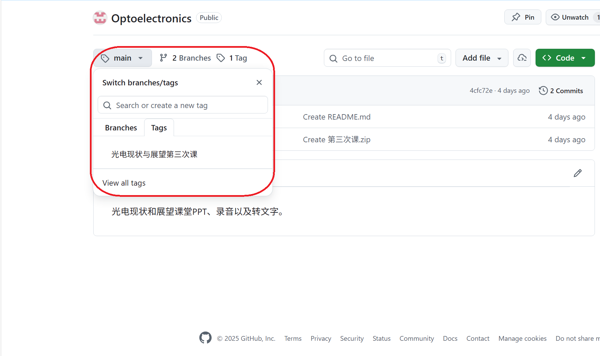
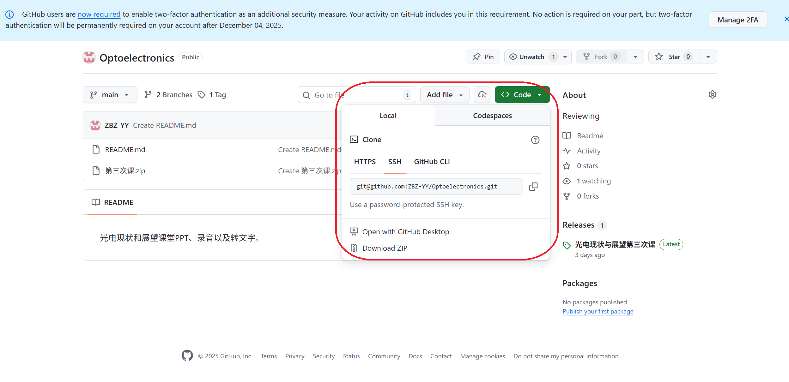
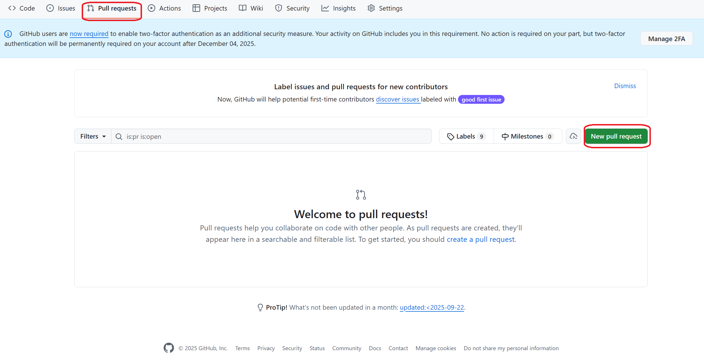
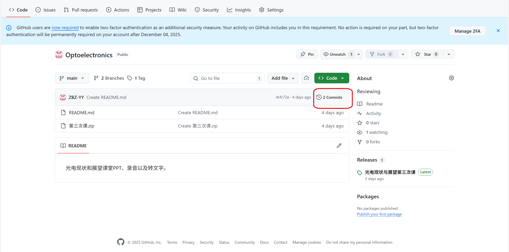
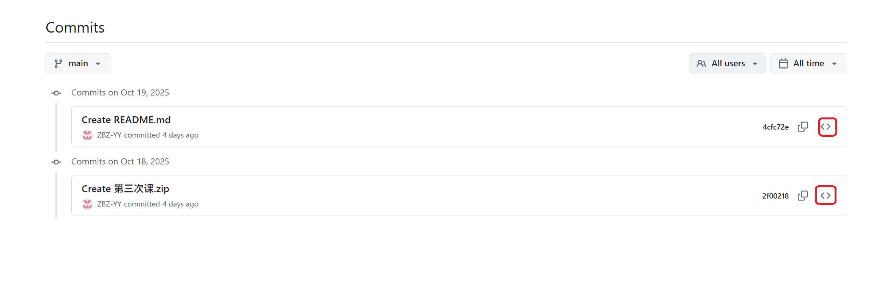

**工光2往年题目以及相关资料。**

Github简单介绍 

分支（Branches）和标签(Tags)：分支下是不同的学科，标签是静态签名，如图二”光电现状与展望第三次课“。如图1、图2所示。

图1 分支与标签

图2 标签

点击“Code”，选择“Download ZIP”，即可以zip形式下载，其他的下载方法需要了解git的基本原理并配置相应环境才能使用。如图3所示。

图3 下载

非开发者点击“Pull request”可以上传文件，上传后我审核通过后可以加入仓库。如图4所示。

图4 Pull requests界面

点击“Commits”，可以查看历史提交记录，点击右边的“<>”可以跳转到这个时候的仓库，界面同图一，可以下载历史上任何时候的资料。如图5、图6所示。

图5 提交的历史记录

图6 提交的历史记录
